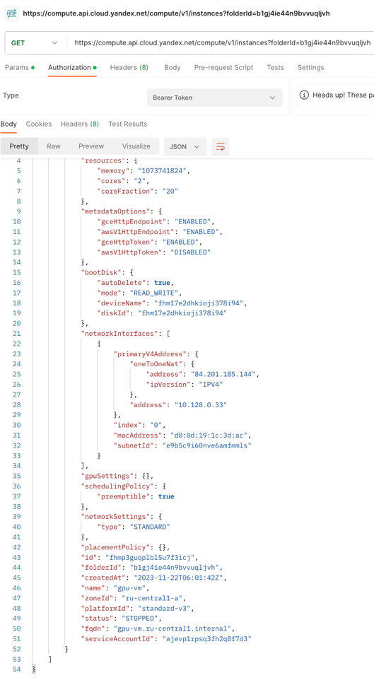
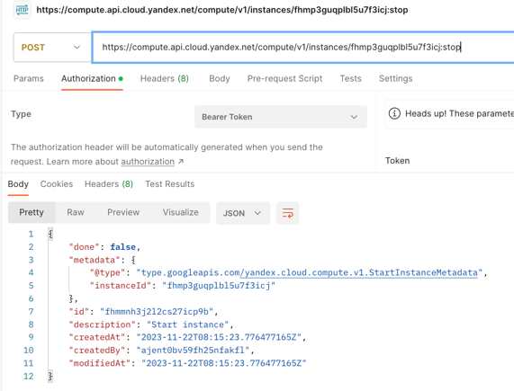
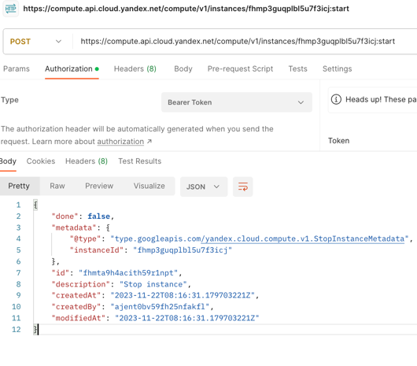

# Тестовое задание ML Разработчик в ["Karma"](https://karma-control.ru)

## Задача:
Написать скрипт на Python, который использует API Яндекс Облака
для запуска машины, заброски туда абстрактного задания на вычисление 
(рекомендуется использовать Docker контейнер) и остановки машины
как только задание выполнено (нужно сообщить с удаленной машины скрипту, 
что задача выполнена, можно останавливаться). 

## Структура решения
- `machine_manager.py` - запуск созданой ранее машины с GPU в Яндекс Облаке, аунтефикация, загрузка задачи и остановка сразу после окончания вычислений
- `machine.py` - выполнение вычислений и отправка запроса о выполнении вычислений
- `Dockerfile` - запуск вычислений в Яндекс Облаке 

## Quick Start
1. [Зарегистрироваться](https://console.cloud.yandex.ru/) в Яндекс Облаке
2. [Создать VM](https://console.cloud.yandex.ru/folders/b1gj4ie44n9bvvuqljvh/compute/create-instance) с необходимыми параметрами
3. Указать в файле `machine_manager.py` 
   - `IAMToken (line 9)` - токен для авторизации, [получить IAM-Token](https://cloud.yandex.ru/docs/iam/operations/iam-token/create-for-sa)
   - `INSTANCE_IP (line 60)` - статический IP VM
   - `INSTANCE_ID (line 61)` - ID машины
4. Доработать функцию `train_model(*args, **kwargs)` в `machine.py`: добавить задачу для вычислений
5. Запустить скрипт `machine_manager.py` так: `python3 machine_manager.py`

## Ход работы:
- Изучение API: оф.сайт, ChatGPT, HFChat, YouTube
- Выбор архитектуры решения и проверка на соответствие ТЗ
- Получение IAM-Token через CLI:
  `yc init`, `yc iam create-token`
- Тестирование работы API Yandex Cloud в Postman

    
    
    

- Написание инструкций в Dockerfile
- Написание README.md

**Время выполнения:** 5 часов

**Автор:** Григорий Чураков